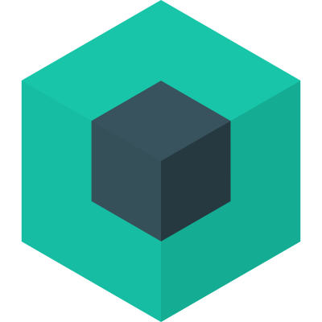

  

# nodepack

A modern node app development platform

**Warning: work in progress**

Nodepack is a modern, integrated and smart development environement for node backend developers. The bundling is done with Webpack.

 

<h3 align="center"><a href="https://nodepackjs.com/">Documentation</a></h3>

 

  

## Sponsors

### Silver

  

  

### Bronze

  

  

## About

**Key benefits:**

- Write backends or apps without worrying about tooling (for example, typescript)
- Minimize configuration and boilerplate
- Produce minimal code size for faster download from npm and quicker bootup in serverless environments
- Migrate and Rollback code and environment (for example DBs) easily in a team
- Integrate with plugins adding ready-to-use features
- Best practices built-in

**Features:**

- zero-config by default
- powerful plugin system
- live-reload in development
- compiled and minified build (useful for function/lambda deployements)
- error diagnostics with suggested fix
- autoinstall missing dependencies
- import/export in .js files
- app/code migrations
- more to come!

**Builtin Integrations:**

- babel (to support old versions of node and/or new JS syntax)
- typescript
- more to come!

**Roadmap:** [v1.0.0](https://github.com/Akryum/nodepack/projects/1)

## Prior Art

[@vue/cli](https://github.com/vuejs/vue-cli)
