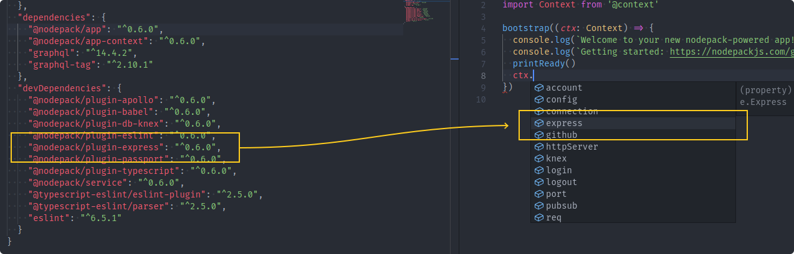

# Context

The Context is an object typically created when your app starts, for every requests made to your server, or individual actions run in your app. Its purpose is to hold useful properties like the database driver you use or information about the currently logged in user.

The Nodepack Context system is designed to be very flexible and extensible with a hook interface. Your code and Nodepack plugins can hook into the context to execute logic automatically or add new properties to the context object. For example, the `@nodepack/plugin-db-knex` plugin will automatically load your `config/db.js` file and add a Knex connection to `context.db`.

You can use the context in both apps, Nodepack plugins or even external code. For example, migrations applied by plugins can use the `context.db` Knex connection setup by the `@nodepack/plugin-db-knex` plugin to execute Database queries.

## Create a context

When you call the `bootstrap` method from `@nodepack/app`, a context will automatically be created and all the `'create'` [hooks](#hook) applied. Here is an example entry point for your project:

```js
// src/index.js

import { bootstrap, printReady } from '@nodepack/app'

bootstrap((context) => {
  console.log(`Welcome to your new nodepack-powered app!`)
  console.log(`Getting started: https://nodepackjs.com/guide`)
  printReady()
})
```

### Manual creation

To manually create a context, use `createContext` from the `@nodepack/app-context` package. Note that it will automatically dispatch the `create` [hook](#hooks).

```js
import { createContext } from '@nodepack/app-context'

async function main () {
  const context = await createContext()
  console.log(context)
}
```

### Configurations

When a context is created, Nodepack will automatically load and put all your project [configuration](./config.md) in the `context.config` property.

For example, if you create a `config/db.js` file in your project like this:

```js
// config/db.js

export default {
  client: 'mysql'
}
```

You will be able to access it with `context.config.db`, for example:

```js
// src/index.js

import { bootstrap } from '@nodepack/app'

bootstrap((context) => {
  console.log('DB client:', context.config.db.client)
})
```

## Hooks

Hooks are events executing logic. All functions registered to a specific hook will be executed when the hook is called.

Use the `hook` method to register a hook into the context:

```js
import { hook } from '@nodepack/app-context'

hook('create', async (context) => {
  context.user = await loginUser(context)
})
```

You can also use the `onCreate` method for the `'create'` hook:

```js
import { onCreate } from '@nodepack/app-context'

onCreate(async (context) => {
  context.user = await loginUser(context)
})
```

### Standard hooks

- `create`: dispatched when a Context is created.
- `bootstrap`: the context has been created when calling `bootstrap()` from `@nodepack/app`. Dispatched after the context creation and before the `bootstrap()` callback is called.
- `printReady`: dispatched when the `printReady()` method from `@nodepack/app` is called. Use to display usefull information when the app is started, such as listening network URLs.
- `destroy`: dispatched when the `destroy()` method from `@nodepack/app` is called. Use to teardown active handlers such as file watchers or network connnections (for example a DB driver).

### Context files

In your project, you can create files in the `src/context` folder. They will be automatically loaded into your app, so it's a good place to hook into the context. For example, let's add an instance of Octokit to consume the GitHub API:

```js
// src/context/github.js

import { onCreate, addProp } from '@nodepack/app-context'
import Octokit from '@octokit/rest'

onCreate (context => {
  addProp(context, 'github', () => new Octokit(context.config.github))
})
```

Most of the time, you should use `addProp` to create a lazy property on the context to improve performance. It will call the init function only once ever only if the property is accessed. If you need a fresh value for each new context, use a simple assignment instead:

```js
// Only if we need a fresh value for each context
context.github = new Octokit(context.config.github)
```

Don't forget to create the related configuration too!

```js
// config/github.js

/** @type {import('@octokit/rest').Options} */
export default{
  auth: process.env.GITHUB_AUTH,
}
```

Then you can use `context.github` in any Context scope:

```js
// src/index.js

import { bootstrap } from '@nodepack/app'

bootstrap(async (context) => {
  const { data } = await ctx.github.repos.getReadme({
    owner: 'Akryum',
    repo: 'nodepack',
    headers: {
      accept: 'application/vnd.github.3.html',
    },
  })
  console.log('Readme:', data)
})
```

If you are using Typescript, you can also export by defaut an interface describing the properties you are adding to the context:

```ts
// src/context/github.ts

import { onCreate, addProp } from '@nodepack/app-context'
import Octokit from '@octokit/rest'
import Context from '@context'

onCreate ((context: Context) => {
  addProp(context, 'github', () => new Octokit(context.config.github))
})

export default interface GitHubContext {
  github: Octokit
}
```

That way, Nodepack will automatically add the `GitHubContext` interface to the `Context` type, just like for plugins (see [Context type](#context-type)).

### Call a hook

Use the `callHook` method to manually call a hook:

```js
import { callHook } from '@nodepack/app-context'

async function main () {
  // ...
  await callHook('loggedIn', context)
}
```

All async hook callbacks will be automatically awaited sequentially by order of registration.

## Context type

If you have `@nodepack/plugin-typescript` installed in your project, types for your context objects will be automatically generated in the `src/generated` folder of your project. This affects [configurations](./config.md), Nodepack plugins and [context files](#context-files).

You can use the `@context` path alias to directly use this type anywhere in your source files:

```ts
import { bootstrap, printReady } from '@nodepack/app'
import Context from '@context'

bootstrap((ctx: Context) => {
  console.log(`Welcome to your new nodepack-powered app!`)
  console.log(`Getting started: https://nodepackjs.com/guide`)
  printReady()
})
```

For example, if the Express plugin adds the `express` property on the context, Nodepack will generate types similar to this:

```ts
// In the Express plugin:
// @nodepack/plugin-express/src/context.d.ts

import Express from 'express'

interface ExpressContext {
  express: Express
}

// In your project generated file:
// src/generated/context.d.ts

interface BaseContext {
  config: Config
}

export default type Context = BaseContext & ExpressContext
```

It will also automatically generate types for the `config` folder. For example if you create a `config/db.ts` file: 

```ts
// config/db.ts
import { Config } from 'knex'

export default {
  client: 'mysql',
  connection: {
    host: '127.0.0.1',
    user: 'your_database_user',
    password: 'your_database_password',
    database: 'myapp_test',
  },
} as Config
```

Node will generate types similar to this:

```ts
// src/generated/config.d.ts
import ConfigDb from '@config/db'

export default interface BaseConfig {
  db: typeof ConfigDb
}
```

Then `context.config.db` will be strictly typed with the Knex config interface:

```ts
import { bootstrap } from '@nodepack/app'
import Context from '@context'

bootstrap((ctx: Context) => {
  console.log('DB client:', ctx.config.db.client)
})
```

Here is another example project with a bunch of Nodepack plugins installed. You can see on the right the IDE auto-completion using the automatic types for the Express plugin:



## Usage outside of app

You can directly load the `context` built fragment of the project:

```js
const { createContext, hook, callHook } = require('my-project/dist/context')
```
